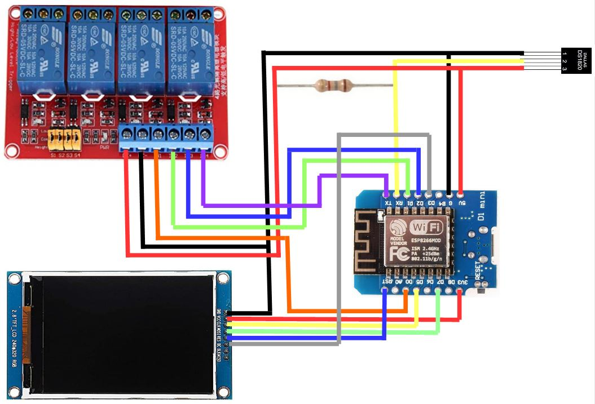
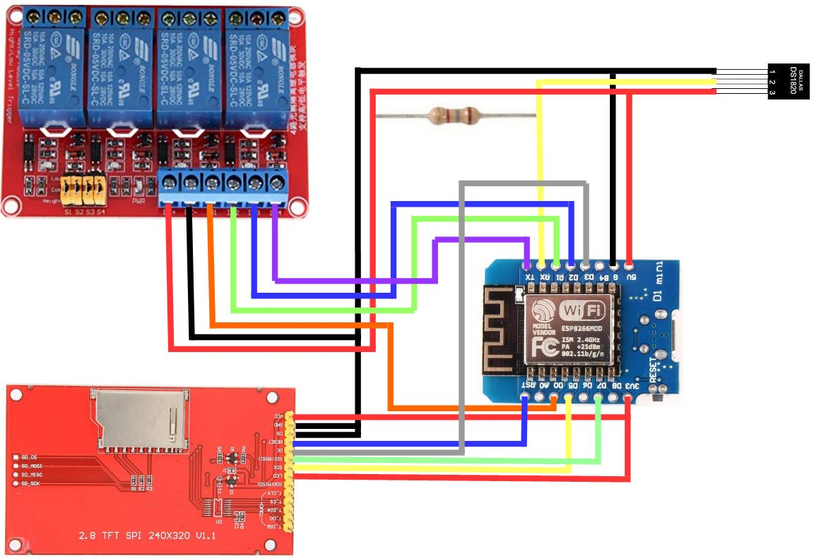

IMiniBrauerei ESP8266 ILI9341 TFT Display
=========================================

WIFI Komplettsteuerung ESP ILI9341 TFT Display Kombi für Brauerei

http://www.schopfschoppe.de/Download.html

Bauteileliste:
--------------

-   Wemos D1 Mini / ESP8266 

-   2,8" ILI9341 Display (Siehe Bild unten)i

-   DS18B20 Temperatursensor

-   Widerstand 4,7 KOhm

-   bis zu 4 SSR oder 4 Relais Board zum Schalten der Funktionen

-   ggf. USB-Kabel und USB-Steckernetzteil ( hat wohl jeder heute was rum zu
    liegen )

Sieht kompliziert aus, ist es aber gar nicht ....

IMiniBrauerei gem. Schaltplan.jpg verdrahten ( in der Configuration können
später die Schaltzustände der Ausgänge auch invertiert werden )

[\>Link zum Display\<](https://www.amazon.de/DollaTek-LCD-Bildschirm-SPI-Modul-Schnittstelle-TFT-Farbbildschirm/dp/B07QFVBPMX)  

[\>Link zum Display mit Touch (in meinem Sketch ohne Funktion)\<](https://www.amazon.de/240x320-LCD-Bildschirm-Serial-Port-Modul-ILI9341/dp/B07MXH92RL/ref=dp_prsubs_1?pd_rd_i=B07MXH92RL)  
[\>Link zum Display ohne Touch\<](https://www.amazon.de/gp/product/B08FJ4NRMK/ref=ppx_yo_dt_b_asin_title_o03_s00?ie=UTF8&psc=1)  

Installation:
-------------

-   IMiniBrauerei am USB-Port anschließen

-   ESP8266Flasher.exe öffnen

-   Auf Config Reiter wechseln

-   IMiniBrauerei_ILI9341_320x240.ino.bin öffnen ( Erstes Zahnrädchen )

-   Auf Operation Reiter wechseln

-   COM-Port des WEMOS auswählen

-   Flashen

### Die IMiniBrauerei ist fertig !

Bedienung:
----------

-   Zwei mal Reset am WEMOS drücken, dazwischen ein zwei Sekunden Pause lassen.

-   WEMOS spannt ein eigenes WLAN-Netzwerk auf, die LED am WEMOS leuchtet
    durchgehend.

-   Mit geeignetem Gerät mit dem WLAN des WEMOS verbinden ( z.B. Handy, Tablet,
    Laptop.... )

-   Browser an dem verbunden Gerät öffnen.

-   Wenn die Config-Seite nicht automatisch öffnet im Browser die Adresse
    192.168.4.1 eingeben

-   Auf Config klicken und die WLAN-Daten und die Ports einstellen -
    anschliessend "SAVE" drücken

-   Der WEMOS prüft jetzt, ob die Eingaben stimmen, verbindet sich mit dem
    angegebenen WLAN-Netzwerk.

Verhalten:
----------

Der WEMOS sendet jetzt im 5 Sekundentakt UDP-Nachrichten mit der Temperatur auf
dem eingegeben Port durchs Netzwerk. Er Empfängt im Schaltbefehle von der
Brauerei, schaltet die Zugehörigen SSRs und stellt den Status als WEBServer
unter seiner IP-Adresse zur Verfügung.

Bedienung in der Brauerei:
--------------------------

-   In der Brauerei Temperaturmessung "IMiniBrauerei/IThermometer" wählen.

-   Auf dem Einstellungs Reiter die "IP-Adresse" des WEMOS und den passenden
    "Port-IN" und "Port-OUT" wählen

Abschluss:
----------

Fertig, die Brauerei sollte jetzt die Temperatur anzeigen und die SSRs sollten
von der Brauerei schaltbar sein Diese Prozedur ist nur einmal nötig. Die
Einstellungen bleiben in der Brauerei und im WEMOS erhalten. Will man die
Einstellungen ändern, 2x mit kurzem Abstand Reset am WEMOS drücken. Die
USB-Verbindung ist ebenfalls nicht mehr nötig. Der WEMOS kann mit einem
beliebigen Handy-USB-Ladegerät mit Spannung versorgt werden. Die
Datenübertragung erfolgt kabellos per WLAN.

Zusatzoptionen:
---------------

-   Wer etwas mehr löten mag kann an den WEMOS noch ein TFT anschließen. Das
    würde ich sehr empfehlen. Man bekommt damit die Soll, Ist-Temperatur,
    Netzwerkstatus der Brauerei, der Schaltzustand der SSRs und vieles mehr
    direkt angezeigt.
    
    
